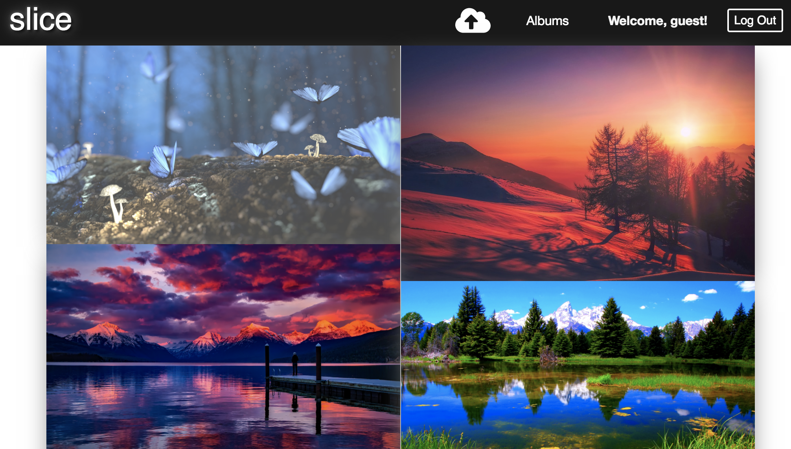

# Slice

Slice is a Flickr-like web app that allows users to upload and store images and render them in a beautiful display. Also featured is the ability to add and delete comments.

[Slice](http://slice-app.herokuapp.com)

## Technologies Used
+ Ruby on Rails
+ PostgreSQL
+ SCSS
+ Cloudinary
+ jQuery
+ Redux
+ React.js

## Features
+ Secure user authentication using BCrypt.
+ Images are rendered in a beautiful gallery and shuffled into place.
+ Photos can be uploaded via drag and drop or file selection.
+ Users can make and delete comments on any picture.



#### Uploading Photos
Users are able to upload photos via drag and drop or by selecting the file. After upload, users are directed to a modal where they can edit title and description information. One challenge was in figuring out how to direct users to an open modal in this scenario as opposed to the default closed modal behavior when the user arrives on  this page. This was achieved by appending a string to the query after users successfully upload, and then checking the presence of that query string in 'this.props.location.search'.

```js
  componentWillReceiveProps(nextProps) {
    if (nextProps.match.params.photoId !== this.props.match.params.photoId) {
      nextProps.fetchPhoto(nextProps.match.params.photoId).then(() => {
        this.setState({showModal: !!this.props.location.search});
      });
    }
    this.setState({photo: nextProps.photo});
  }
```
#### Photo edits and deletion
  Owners of photos are able to gain access to owner buttons that allow them to make edits and delete photos. The logic for the display of these buttons start in a JBuilder file that checks whether the current photo's owner id is the same as the current user's id, and returns a boolean value.

  ```ruby
    json.ownerOwns (photo.owner_id == current_user.id)
  ```
  If the ownerOwns value is truthy, then an ownerButtons variable becomes defined and later rendered. The edit button opens a modal for editing of photo details while the delete button directly executes a photo deletion. Non-owner users who are browsing through photos do not get access to these buttons.

  ```js
    let ownerButtons;
    if (this.props.photo.ownerOwns) {
      ownerButtons = (
        <div className="owner-btns">
          <button className="photo-edit-btn" onClick={this.handleOpenModal}>Edit</button>
          <Link to="/">
            <button className="photo-del-btn" onClick={()=>this.props.deletePhoto(photo.id)}>Delete
            </button>
          </Link>
        </div>
      );
    }
  ```


## Future Improvements

#### Album Upload
In the future, allowing users to upload photos into albums would be a great feature.

#### Tags
Allowing photo owners to tag their photos with labels is feature to be added that would allow for greater user interaction.
